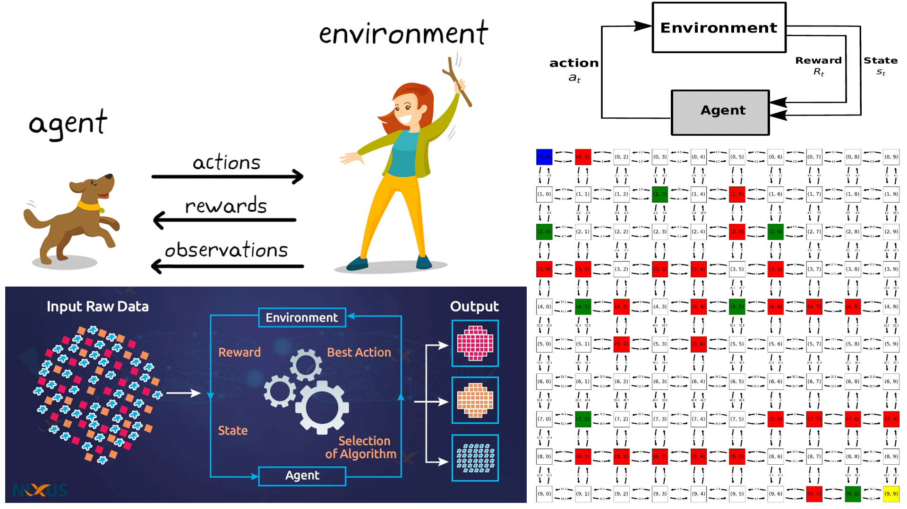

# Solving-Multi-Flag-Maze-Using-QLearning

## Table of Contents
- [Project Description](#project-description)
- [Concepts and Components](#concepts-and-components)
- [Dependencies](#dependencies)

## Project Description

This project focuses on implementing Q-Learning for solving pathfinding problems in grid environments. The goal is to determine and reduce the number of model states through state equivalence. The code includes functions for Q-Learning, pathfinding, visualization, and experimentation with different learning parameters.

## Concepts and Components

The project revolves around the following key concepts and components:

- **States:** These correspond to agent positions in the environment.

- **Actions:** Actions define agent movements, including "up," "down," "left," and "right."

- **Rewards:** Rewards define penalties and incentives associated with each state.

- **Goal State:** The end point to reach, marked as "T" in the environment.

- **Learning Rate (α) Impact:** This parameter affects the speed of convergence and oscillation in the Q-Learning process. It also balances exploration vs. exploitation and influences stabilization and solution accuracy.

- **Discount Factor (γ) Impact:** The discount factor impacts the trade-off between long-term and short-term rewards, influences the optimal policy, and affects convergence and temporal consistency.

## Dependencies

This project relies on the following Python libraries:

- `numpy`: For numerical operations and data manipulation.
- `matplotlib`: For data visualization.
- `networkx`: For drawing network graphs.
- `networkx.drawing.nx_pydot`: For graph visualization using Pydot.

